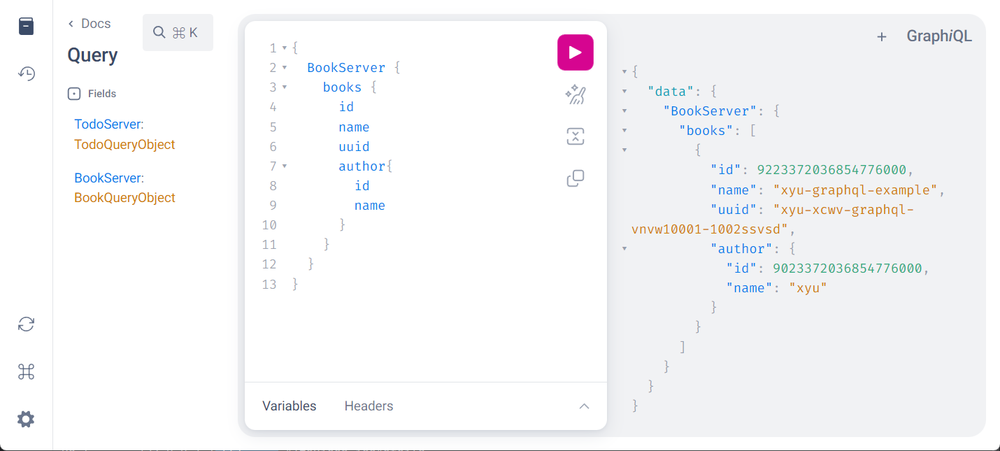

# xyu-graphql
example of gqlgen
星星超过10个我就开放完整版本代码，或者自己拉取研究，此版本距离成功只差一步

## 启动
+ go get github.com/99designs/gqlgen
+ go run main.go

## 重新构建
+ 更新gaphql文件
+ 执行gqlgen

## 步骤
+ 1.更新base.graphql文件和dao/model下面的结构体
+ 2.删除目录 generated, graph
+ 3.命令行执行gqlgen
+ 4.使用生成的base_gen.go的内容覆盖pro_gen.go,删除base_gen.go
+ 5.再次命令行执行gqlgen
+ 6.删除新生成的base_gen.go
+ 7.去generated将错误的包引用改正确
+ 8.实现resolver接口
+ 9.运行即可

